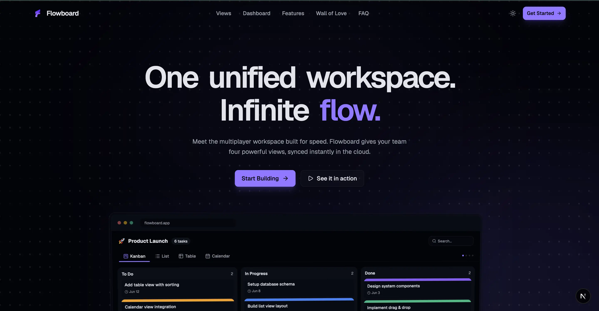
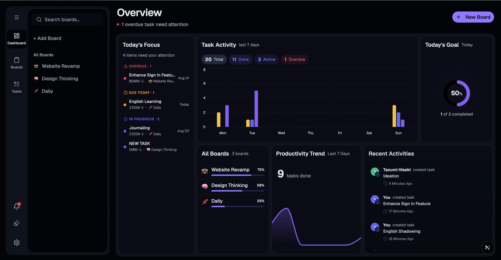

<div align="center">
  
  
  # 🚀 Flowboard
  
  **One unified workspace. Four powerful views. Infinite flow.**
  A modern, high-performance productivity application designed to organize workflows seamlessly. Built with a focus on speed, intuitive collaboration, and a premium user experience.
  
  [](https://nextjs.org/)
  [](https://www.typescriptlang.org/)
  [](https://tailwindcss.com/)
  [](https://supabase.com/)
  [](https://ui.shadcn.com/)
</div>

<br />

<div align="center">
  
  <br />
  
</div>

---

## ✨ Key Features & Architecture

Flowboard is architected to deliver a premium, fluid experience from the moment users land on the marketing page to their day-to-day interactions within the workspace.

### 🎨 1. Modern Landing Page (`/`)
The entry point of the application is a highly interactive, performance-optimized marketing page:
- **Interactive Dot Grid:** A custom HTML5 Canvas particle system that reacts to mouse movements.
- **Smooth Animations:** Orchestrated scroll animations and viewport-triggered transitions for UI components like Bento Grids and Feature Showcases.
- **Modern UI Design:** Clean interface utilizing glassmorphism, subtle gradients, and semantic typography for a clear user experience.

### 💼 2. The Core Workspace (`/app`)
The core productivity engine, powered by a robust backend and optimistic UI updates:
- **📊 Analytics Dashboard:** A comprehensive overview featuring real-time "Task Completion Charts," "Productivity Trends," and dynamic task summaries powered by Recharts.
- **🗂️ Multi-Board Management:** Create, edit, and organize multiple independent boards with custom icons and favorite toggles.
- **👁️ 4 Dynamic Task Views:** Instantly toggle between different visualization modes without reloading:
  - **Kanban View:** A fluid drag-and-drop board powered by `@dnd-kit`.
  - **List View:** A structured, compact layout for quick scanning.
  - **Table View:** A dense, sortable data grid interface powered by `@tanstack/react-table`.
  - **Calendar View:** A monthly calendar grid to track deadlines at a glance.
- **🤝 Real-time Collaboration:** Share boards with team members, assign tasks, leave comments, and receive instant toast alerts and system notifications.
- **✅ Global "My Tasks" Hub:** A dedicated page aggregating all tasks assigned to the user across all boards, filterable by due dates and status.

### ⚙️ 3. Backend & User Experience
- **Supabase Integration:** Full authentication (Google OAuth & Email) and PostgreSQL database implementation.
- **Real-time Optimistic Updates:** Client-side state updates instantly before server confirmation, ensuring a zero-latency feel.
- **Interactive Onboarding:** A guided product tour using `react-joyride` with custom-styled Tooltips to educate new users seamlessly.
- **Profile Customization:** Users can customize their Display Name and Avatar Color via a bespoke Settings Modal, synced directly with Supabase Profiles.

---

## 🛠️ Tech Stack

| Technology | Purpose | Rationale |
| :--- | :--- | :--- |
| **Next.js 15** | Core Framework | App router architecture, dynamic routing (`/app/[boardId]`), and optimized rendering. |
| **React 19** | Rendering & UI | Leveraging the latest React features for building responsive user interfaces. |
| **Tailwind CSS v4** | Styling System | Rapid utility-first styling with modern CSS variables and native dark mode support. |
| **TypeScript** | Static Typing | Complete end-to-end type safety, from database schemas to UI components. |
| **Supabase** | Backend as a Service | Secure Auth, Postgres DB, and RLS (Row Level Security) policies. |
| **Framer Motion** | Animations | Complex, physics-based UI animations, page transitions, and interactive scrolls. |
| **React Joyride** | User Onboarding | Creates guided, interactive product tours for new users navigating the workspace. |
| **Recharts** | Data Visualization | Renders dynamic, responsive, and composable SVG charts for the Analytics Dashboard. |
| **shadcn/ui** | Component Library | Highly customizable, accessible UI primitives for a polished look. |
| **@dnd-kit & TanStack**| Advanced UI Logic | Robust drag-and-drop primitives and headless tables for complex data structures. |

---

## 🚀 Getting Started

### Prerequisites
Make sure you have **Node.js** (v18+) and **npm** installed on your system.
You will also need a **Supabase** project for the backend database and authentication.

### 1. Clone the Repository
```bash
git clone https://github.com/yossyadirta/flowboard.git
cd flowboard
```

### 2. Install Dependencies
```bash
npm install
```

### 3. Environment Variables
Create a `.env.local` file in the root directory and add your Supabase credentials:
```env
NEXT_PUBLIC_SUPABASE_URL=your_supabase_project_url
NEXT_PUBLIC_SUPABASE_ANON_KEY=your_supabase_anon_key
```

### 4. Run the Development Server
```bash
npm run dev
```
Open [http://localhost:3000](http://localhost:3000) in your browser to view the application.
